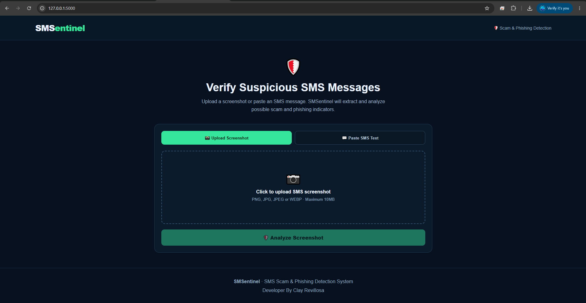

# SMSentinel

Web-based SMS Scam & Phishing Detector.


## Developer
Clay Revillosa

## Features
- Screenshot upload
- OCR text extraction
- Paste SMS text
- Suspicious keyword detection
- OTP/PIN/password detection
- Suspicious URL analysis
- Risk score and recommendation

## Installation

### 1. Install Python packages
```bash
pip install -r requirements.txt
```

### 2. Install Tesseract OCR
Windows: install Tesseract OCR, then ensure `tesseract.exe` is available in your PATH.

Ubuntu/Debian:
```bash
sudo apt update
sudo apt install tesseract-ocr
```

### 3. Run
```bash
python app.py
```

Open:
http://127.0.0.1:5000

## Note
This is a prototype/rule-based detector. A low-risk result does not prove that an SMS is legitimate.
